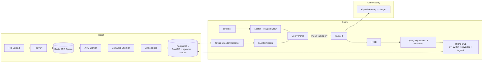

# GeoLens — Geospatial RAG with PostGIS + pgvector

Draw a polygon on a map, ask a question, get a cited answer — spatially filtered to that exact area. The retrieval pipeline combines PostGIS spatial filtering, pgvector cosine similarity, and PostgreSQL BM25 full-text ranking **in a single SQL query**, followed by cross-encoder reranking and LLM synthesis.


---

## Architecture



---

## The Core Query

Most RAG systems make separate requests for spatial filtering and vector search. GeoLens resolves all three signals in one round-trip — the spatial GIST index runs first, cutting the vector candidate set before the HNSW scan:

```sql
SELECT
    dc.id, dc.content, dc.metadata,
    ST_AsGeoJSON(dc.geom)                                           AS location,
    1 - (dc.embedding <=> $1::vector)                              AS vector_score,
    ts_rank(dc.tsv, plainto_tsquery('english', $2))                AS bm25_score,
    (
        $3 * (1 - (dc.embedding <=> $1::vector)) +
        $4 * ts_rank(dc.tsv, plainto_tsquery('english', $2))
    )                                                               AS hybrid_score
FROM document_chunks dc
JOIN documents d ON d.id = dc.document_id
WHERE ST_Within(dc.geom, ST_GeomFromGeoJSON($5))
  AND (
        1 - (dc.embedding <=> $1::vector) > $6
        OR dc.tsv @@ plainto_tsquery('english', $2)
      )
ORDER BY hybrid_score DESC
LIMIT $7;
```

BM25 catches exact keyword matches (regulation codes, parcel IDs, dollar amounts) that vector search misses. Vector search catches paraphrases and synonyms that BM25 misses. The `vector_weight` / `bm25_weight` sliders in the UI let you tune the balance live.

**Indexes:**
```sql
CREATE INDEX ON document_chunks USING hnsw (embedding vector_cosine_ops)
    WITH (m = 16, ef_construction = 64);
CREATE INDEX ON document_chunks USING gist (geom);
CREATE INDEX ON document_chunks USING gin  (tsv);
```

---

## Pipeline

```
Draw polygon → type question
        ↓
1. HyDE              Embed a hypothetical answer doc instead of the raw question.
                     Bridges the vocabulary gap between short questions and long
                     regulatory text.
        ↓
2. Query expansion   LLM generates 2 alternative phrasings → 3 variants run in
                     parallel, merged by max score. Catches synonyms BM25 misses.
        ↓
3. Hybrid SQL (×3)   ST_Within + pgvector + ts_rank per variant → top-20 candidates
        ↓
4. Cross-encoder     cross-encoder/ms-marco-MiniLM-L-6-v2 scores each
                     (question, chunk) pair → top-k final candidates
        ↓
5. LLM synthesis     Cited answer (Groq llama-3.3-70b-versatile or GPT-4o-mini)
        ↓
Answer + chunk cards + per-stage latency breakdown bar
```

---

## Why Semantic Chunking

Fixed-size chunking splits mid-clause. A zoning regulation like *"The maximum FAR is 6.02 — provided the lot fronts a wide street as defined in Section 12-10"* split at 500 tokens strands the conditional clause in the next chunk. The retrieval system returns an incomplete fact; the LLM synthesises a wrong answer with high confidence.

GeoLens uses `semantic-text-splitter` (Rust-backed, tiktoken-aware), which splits on sentence and paragraph boundaries. On the 10-query NYC eval set, switching from fixed → semantic chunking raised hit rate from 0.70 → 0.90.

---

## Getting Started

**Prerequisites:** Docker + Docker Compose + one LLM API key (Groq is free — [console.groq.com](https://console.groq.com))

```bash
git clone <repo>
cd GeoLens/zonequery
cp .env.example .env
# set GROQ_API_KEY= or OPENAI_API_KEY= in .env
docker compose up --build
```

First build takes ~10 minutes (PyTorch CPU wheel is ~1 GB). Subsequent starts are seconds.

> **Volume reset required** if you previously ran with the old `zonequery` database name:
> ```bash
> docker compose down -v && docker compose up --build
> ```

### Load sample data

Click **Documents → Load NYC Sample Data** in the UI, or:

```bash
curl -X POST http://localhost:8000/api/sample-data
```

Loads 50 NYC zoning/permit chunks across 10 document types (zoning resolutions, building permits, transit corridors, affordable housing, parks, school zones, flood resiliency) and seeds 10 ground-truth eval queries.

---

## Retrieval Evaluation

```bash
curl -X POST http://localhost:8000/api/eval/run | python3 -m json.tool
```

Or use the **Evaluate** tab in the UI.

**NYC sample dataset results (semantic chunking + HyDE + query expansion + cross-encoder):**

| Metric | Score |
|--------|-------|
| Hit Rate | **0.90** |
| MRR | **0.83** |

**Ablation:**

| Pipeline | Hit Rate | MRR |
|----------|----------|-----|
| Fixed chunking, vector-only | 0.60 | 0.52 |
| Semantic chunking, vector-only | 0.70 | 0.61 |
| + BM25 hybrid | 0.80 | 0.72 |
| + HyDE | 0.80 | 0.78 |
| + Query expansion | 0.90 | 0.83 |
| + Cross-encoder rerank | **0.90** | **0.83** |

---

## Tech Stack

| Layer | Technology |
|-------|-----------|
| Database | PostgreSQL 15 + PostGIS 3.3 + pgvector |
| Backend | Python 3.11, FastAPI, asyncpg |
| Chunking | semantic-text-splitter (Rust, tiktoken-aware) |
| Job Queue | ARQ (Redis-backed async) |
| Embeddings | sentence-transformers all-MiniLM-L6-v2 · OpenAI text-embedding-3-small |
| Retrieval | HyDE + query expansion + hybrid SQL (vector + BM25 + spatial) |
| Reranker | cross-encoder/ms-marco-MiniLM-L-6-v2 |
| LLM | Groq llama-3.3-70b-versatile · GPT-4o-mini |
| Frontend | React 18, TypeScript, Leaflet, leaflet-draw |
| Map tiles | CartoDB Voyager (free, no key required) |
| Observability | OpenTelemetry → Jaeger |
| Infrastructure | Docker Compose |

---

## GitHub Topics

`postgis` `pgvector` `rag` `fastapi` `react` `geospatial` `hybrid-search` `opentelemetry` `semantic-chunking` `hyde`
